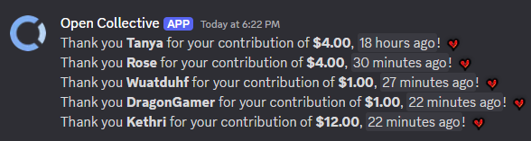

# open-collective-transactions-discord
Stream Open Collective transactions into a Discord channel via webhooks.

Open Collective lacks the ability to send fine-grained events to a webhook. This project achieves that. By default all transactions of type `CREDIT` are sent with the gross amount donated by a person.

The transaction parameters and message can be adjusted very easily with minimal modification, or open an issue to request a feature.



# Setup
Set the environment variables, suggested in a `.env` file
```
# Secrets
OC_API_KEY=
WEBHOOK_URL=

# Settings
OC_ACCOUNT_SLUG=

# See main.py for more settings.
```

By default, the script will review the past 12 hours for new transactions. Use your automation of choice to run the script more frequently than that.
